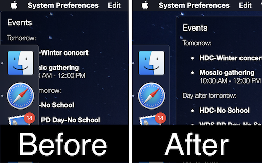

# Margins
An [Übersicht](http://tracesof.net/uebersicht) widget that that makes it easy to prevent other widgets from colliding with the Dock or your desktop icons.

The widget programmatically sets margins around the overall Übersicht container, thereby moving all your widgets out from underneath the Dock and/or your desktop icons automatically, **without needing to edit the widgets themselves**. The margin sizes are calculated automatically based on your Dock and desktop icon preferences.

## Instructions
### Initial setup
Edit margins.coffee to set the following variables according to your preferences:

- `avoid_dock` (default: `true`). Whether to keep widgets out from under the Dock.
- `icon_columns` (default: `0`). Number of icon columns on the right side of the desktop to leave space for.
- `static_margin` (default: `0`). A default margin around the Übersicht container, measured in px.

### Usage
- If you change your Dock's position, size, hiding behaviour, etc., just refresh this widget.
- If you change the icon size, grid spacing, etc., specified in your desktop view options, just refresh this widget.
- If the number of icons on your desktop changes substantially, edit the `icon_columns` variable and save to refresh this widget.

When the widget refreshes, new margins will be calculated and applied automatically.

## How it works
Setting margins around the overall Übersicht container adjusts the origin points for the left/right/top/bottom cooridinates that all your widgets use to position themselves. By settings these margins to account for the position and size of your Dock, for example, a widget positioned at `left: 0; bottom: 0;` can be moved from the very bottom left corner of your display to a position near that corner *but not underneath the Dock*. Importantly, this is done without changing the `left: 0; bottom: 0;` specified in the widget's internal stylesheet, which means that it can be done on the fly.

The dynamic margin sizes are determined programmatically based on your Dock and desktop icon preferences. If you want a margin to account for your desktop icons, you only need to specify how many columns of icons you want to leave space for. You do not need to figure out the exact pixel values for yourself.

If you like, you may also use `static_margin` to set a default margin width to use on the remaining sides of the display. This static margin will be combined with the dynamic margins where appropriate.

## License
This work is released under the [CC0 license](https://creativecommons.org/publicdomain/zero/1.0/):

To the extent possible under law, the author has waived all copyright and related or neighboring rights to the software.
